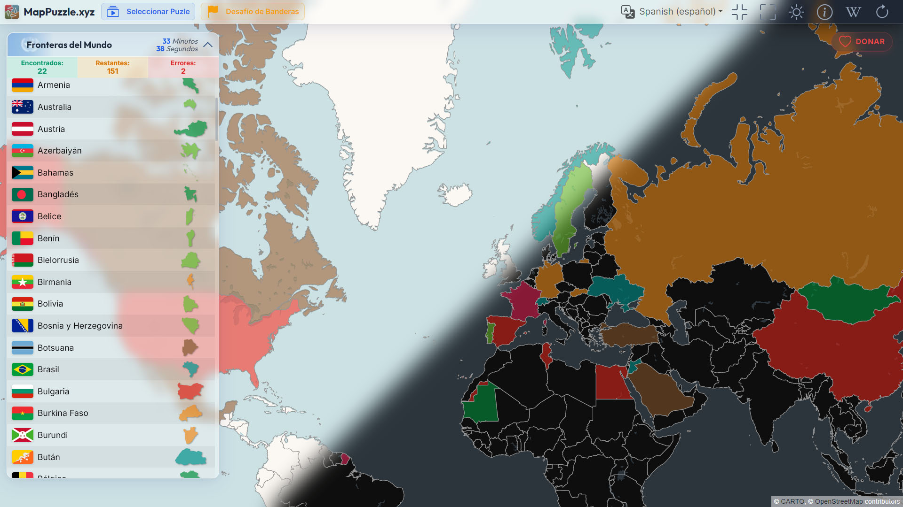

# MapPuzzle.gl

**MapPuzzle.xyz** is a platform that immerses you in hours of entertainment through flags, maps, and puzzles from various parts of the world. The game is designed for players of all ages and skill levels, offering a comprehensive and enriching educational experience.

## Available Games

Currently, there are two different games: Geographical Puzzles and Guess the Flag.

### Geographical Puzzles
- Choose from available puzzles representing different regions of the world, including countries, states, or provinces.
- In the interface, the map is displayed on the right with its borders, while on the left, there is a list of elements with their respective silhouettes. Your task is to place each piece in its corresponding location.
- Additionally, every time a piece is placed on the map, players can access Wikipedia data about the place they are exploring. This allows them to obtain additional information about the geography, history, culture, and other areas related to the place, helping them learn more about the world around them.

### Guess the Flag
- Observe a waving flag and the silhouette of the country on the right.
- Choose from six available options to correctly identify the country to which it belongs.
- Once the game is finished, you can explore the map and obtain additional information about the country from Wikipedia.

## Game Modes

Both games offer detailed tracking of your successes, the list of remaining elements, errors made, and the time devoted to the activity.

Players can choose the map they want to play, filtering by continent and region. One interesting feature of the game is that it allows players to translate the names of the puzzle pieces into different languages. This enriches their gaming experience and helps them develop their language skills.

## How to play

You can play the game in the following link: [MapPuzzle.xyz](https://mappuzzle.xyz/)

## Code Description

**MapPuzzle.xyz** is a React application built with Vite, drawing its maps with
deck.gl. The published site is nothing but static files plus a small read-only
PHP gateway over a SQLite file: there is no Node.js on the server. The map
editor and its Node backend run locally only, to author the content that gets
uploaded.

- **React 18** for the interface, **Vite 6** for the build and dev server, with
  offline support through `vite-plugin-pwa`.
- **deck.gl** renders the map and its pieces over WebGL.
- **SQLite** holds the puzzles, the Wikipedia links, the flags and the 73k name
  translations. In production it is read-only, reached through the PHP gateway
  in `apps/game/public/backendPHP/`.
- **Express + TypeORM** is the editor's backend. It writes the database, imports
  shapefiles and pulls content from Wikipedia. Local only.
- **Shapefiles are read directly** with the `shapefile` package. PostgreSQL and
  PostGIS are no longer involved anywhere, and the piece silhouettes are
  generated at runtime from the geometry instead of being stored in the map.

## Project layout

The repository is a monorepo. npm workspaces cover `packages/*`; the apps are
built through their own Vite configs from the root.

| Path | What it is |
| --- | --- |
| `apps/game` | MapPuzzle and FlagsQuiz. The only thing deployed. |
| `apps/editor` | The map editor, a separate client. |
| `apps/backend` | Express + TypeORM. Authoring only, never published. |
| `packages/core` | Code both clients share: services, geometry, UI pieces. |
| `packages/shared` | Type declarations only, the contract between the two sides. |
| `data/` | What the editor produces: maps, flags, sitemap and the SQLite file. |
| `scripts/` | Build and release helpers: prerender, publish-db, deploy. |
| `build/` | The output, and exactly what gets uploaded. |

## Requirements

**Node.js 22 or newer** — the prerender step reads the database through
`node:sqlite`, which is not in earlier versions. Tested on Node 24.

One pinned dependency worth knowing about: `"react-map-gl": "5.3.21"`. From 6.0.0
onwards it requires a Mapbox access token, and that means a paid plan.

## Scripts

Thirteen, and each one is a job someone actually does.

**Developing**

| Script | What it does |
| --- | --- |
| `dev` | The game against the local Node backend. Needs `backend` running. |
| `dev-php-backend` | The game against a PHP backend on port 8888, to try changes to the gateway itself. |
| `editor` | The map editor, on port 3001. Always needs the Node backend. |
| `backend` | Express + TypeORM on port 5000. |

**Checking**

| Script | What it does |
| --- | --- |
| `typecheck` | All three projects. |
| `typecheck:game`, `typecheck:editor`, `typecheck:backend` | One at a time. |

**Releasing**

| Script | What it does |
| --- | --- |
| `build` | The production build, then the prerender step. What gets deployed. |
| `preview` | Serves that build on port 3000. The port is fixed on purpose: the production PHP gateway only accepts that origin, so any other one fails CORS and the game loads without data. |
| `publish-db` | Copies the authoring database over the published one, showing both digests first. `--check` fails instead of writing. |
| `deploy` | Uploads over FTP, comparing the generated content by size and sending only what differs. |
| `deploy:app` | The same, skipping that comparison — the app shell only, which is the usual case after a code change. |

`--dry-run` prints a deploy plan without uploading anything. FTP credentials come
from `.env.deploy`, which is gitignored. The prerender step can be run on its own
against an existing build with `node scripts/prerender.mjs`, and `--check` there
reports what it would write.

## How a puzzle is addressed

Every puzzle has a page of its own — `/map/<slug>/`, and `/flag-quiz/<slug>/`
for the ones with flags — and `scripts/prerender.mjs` writes a real HTML file
for each at build time, carrying its own title, description, canonical link and
the region names as text. They are files rather than rewrite rules because the
host answers 404 to any path that is not one.

The older query form, `/?map=<slug>`, still works and is rewritten to the
canonical path once the app boots. Slugs are stored with underscores and use
hyphens in URLs. The same step regenerates `sitemap-index.xml`, which is the
sitemap `robots.txt` declares; the editor's *Generate sitemap* writes the same
thing.

Because a page is served from its own directory, anything addressed from the
site root has to say so: `siteAsset()` in `packages/core/src/lib/data.ts` is
what pins content paths — maps, flags, logos, textures — to `/`.

## Design

The interface is a set of glass panels floating over the map. Everything that
defines the look is a CSS custom property declared once, at the top of
`apps/game/src/styles/MapPuzzle.css`, so a change lands everywhere at once.

- **Glass surfaces.** `--glass-bg`, `--glass-border` and `--glass-shadow` with
  `backdrop-filter`, on the tool panel, the piece list, the top bar and the
  dialogs — eighteen places in the main stylesheet, two more in the quiz.
- **Light and dark.** The same tokens redefined under `[data-bs-theme="dark"]`,
  from `#f1f5f9` on white glass to `#090d16` on slate. The choice is the
  player's and is remembered on their device.
- **Typography.** Outfit for titles, Inter for text, both self-hosted as
  variable fonts — one file per family covering weights 100 to 900, so the page
  asks nothing of a font CDN and no weight costs an extra download.
- **Custom cursors.** `--cursor-grab` and `--cursor-grabbing` point at SVGs, so
  the pointer says whether a piece can be taken and whether it is being held.
- **Accent.** One `--accent-color` with a matching `--accent-glow` for focus and
  hover, blue on both themes.
- **Bootstrap underneath.** Its own `--bs-*` variables are overridden rather
  than fought, and the iconography is Bootstrap Icons.
- **Responsive.** `styles/responsive.css`, including specific work for ultrawide
  screens, where the quiz's radial fill needed its own handling.

The pieces keep their bright, contrasting colours: they are the one thing that
has to read instantly against the map.

Alongside the redesign the client was made lighter — cursor tracking and the
deck.gl layers were reworked, and the two secondary screens (the flags quiz and
the donate page) load as separate chunks instead of riding in the main bundle.

## Credits

This project was developed by Alejandro Aranda, and is a part of the [MapPuzzle.gl](https://mappuzzle.xyz/) project.

## License

This project is licensed under the MIT license, is free to use, modify and distribute.

## contact

If you have any questions, you can contact me at: https://aaranda.es/en/contact/

## Donate

If you want to support the project, you can donate at: https://github.com/sponsors/alexwing
